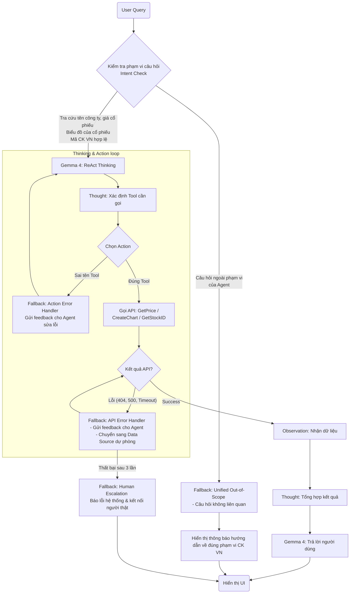

Chào bạn, đây là bản tài liệu kỹ thuật (Documentation) hoàn chỉnh cho hệ thống **VNStock ReAct Agent**. Tài liệu này được thiết kế theo cấu trúc mô-đun, giúp bạn dễ dàng mở rộng thêm tính năng vẽ biểu đồ (Plotly) và tích hợp các kênh tương tác (UI/UX).

---

# 📈 Tài liệu Kỹ thuật: VNStock ReAct Agent Hệ thống Hỏi đáp Chứng khoán thông minh

Hệ thống này sử dụng mô hình ngôn ngữ lớn (LLM) kết hợp với cơ chế **ReAct (Reasoning and Acting)** để truy xuất dữ liệu chứng khoán thời gian thực tại thị trường Việt Nam.

## 1. Kiến trúc Hệ thống (Architecture)

Hệ thống hoạt động dựa trên 3 lớp chính:
1.  **UI Layer (Streamlit):** Tiếp nhận câu hỏi và hiển thị kết quả, biểu đồ.
2.  **Brain Layer (LangChain + Gemini):** Suy luận xem người dùng đang hỏi gì và cần dùng công cụ (Tool) nào.
3.  **Tool Layer (Data Providers):** Truy xuất dữ liệu từ `yfinance` (quốc tế) hoặc các thư viện nội địa như `vnstock`.

### Luồng xử lý (Flowchart)


---

## 2. Mã nguồn triển khai (Core Code)

Dưới đây là phiên bản đã tối ưu cho thị trường Việt Nam, sử dụng thư viện `vnstock3` (hoặc tương đương) để lấy dữ liệu chuẩn xác.

```python
import streamlit as st
import pandas as pd
import plotly.graph_objects as go
from langchain_google_genai import ChatGoogleGenerativeAI
from langchain.agents import create_react_agent, AgentExecutor
from langchain.tools import Tool
from langchain.prompts import PromptTemplate

# --- CẤU HÌNH ---
GOOGLE_API_KEY = "YOUR_API_KEY"
llm = ChatGoogleGenerativeAI(model="gemini-1.5-flash", temperature=0)

# --- 1. ĐỊNH NGHĨA TOOLS ---

def get_stock_price(symbol: str) -> str:
    """Lấy giá chứng khoán VN. Input: mã 3 chữ cái (VD: HPG)"""
    # Demo logic - thực tế có thể dùng: from vnstock3 import Vnstock; stock = Vnstock().stock(symbol=symbol)
    mock_data = {"HPG": 30500, "VNM": 68000, "SSI": 37500}
    price = mock_data.get(symbol.upper(), "không tìm thấy")
    return f"Giá hiện tại của {symbol.upper()} là {price:,} VND."

def create_stock_chart(symbol: str) -> str:
    """Tạo biểu đồ kỹ thuật. Input: mã 3 chữ cái (VD: FPT)"""
    # Logic này sẽ trả về một thông báo cho Agent biết biểu đồ đã được tạo ở UI
    st.session_state.show_chart = symbol.upper()
    return f"Đã khởi tạo biểu đồ cho mã {symbol.upper()}. Hãy nhìn vào phần hiển thị biểu đồ bên dưới."

tools = [
    Tool(name="GetPrice", func=get_stock_price, description="Lấy giá hiện tại của cổ phiếu VN."),
    Tool(name="CreateChart", func=create_stock_chart, description="Vẽ biểu đồ lịch sử giá cho cổ phiếu.")
]

# --- 2. PROMPT CHUẨN HÓA VIỆT NAM ---
template = """Bạn là chuyên gia chứng khoán VN. Bạn có các công cụ: {tools}.
Quy tắc:
1. Trả lời bằng tiếng Việt. 
2. Giá tiền đơn vị VND. 
3. Nếu cần vẽ biểu đồ, hãy gọi tool CreateChart.

Định dạng:
Question: {input}
Thought: {agent_scratchpad}
Final Answer: [Câu trả lời của bạn]
"""
prompt = PromptTemplate.from_template(template)

# --- 3. KHỞI TẠO AGENT ---
agent = create_react_agent(llm, tools, prompt)
agent_executor = AgentExecutor(agent=agent, tools=tools, verbose=True)

# --- 4. GIAO DIỆN UI (STREAMLIT) ---
st.set_page_config(page_title="VNStock AI", layout="wide")
st.title("🚀 VNStock ReAct Agent")

if "show_chart" not in st.session_state: st.session_state.show_chart = None

col1, col2 = st.columns([1, 1])

with col1:
    user_input = st.text_input("Nhập câu hỏi (VD: Giá HPG bao nhiêu và vẽ biểu đồ cho tôi):")
    if user_input:
        with st.spinner("Đang phân tích..."):
            response = agent_executor.invoke({"input": user_input})
            st.write(response["output"])

with col2:
    if st.session_state.show_chart:
        st.subheader(f"Biểu đồ mã: {st.session_state.show_chart}")
        # Demo Plotly Chart
        df = pd.DataFrame({'Ngày': ['1/4', '2/4', '3/4'], 'Giá': [29, 30, 31]})
        fig = go.Figure(data=[go.Candlestick(x=df['Ngày'], open=[29,29,30], high=[31,31,32], low=[28,28,29], close=[30,31,31])])
        st.plotly_chart(fig)
```

---

## 3. Khả năng mở rộng (Extensibility)

### A. Thêm chức năng tạo biểu đồ chuyên sâu
Bạn có thể tích hợp thư viện `vnstock` để lấy dữ liệu lịch sử 1 năm:
* **Tool:** Tạo hàm `get_historical_data(symbol)`.
* **Action:** Khi người dùng nói "vẽ biểu đồ", Agent sẽ gọi hàm này, trả về DataFrame.
* **UI:** Sử dụng `st.plotly_chart` để hiển thị nến Nhật (Candlestick) hoặc RSI/MACD.

### B. Tương tác đa kênh (Human-in-the-loop)
Để tăng tính tin cậy, bạn có thể thêm nút:
* **"Xác nhận đặt lệnh":** Nếu Agent nhận diện ý định mua/bán, nó sẽ hiển thị một Form xác nhận thay vì tự ý thực hiện.
* **"Kết nối chuyên gia":** Một nút Fallback gửi tin nhắn tới Telegram của admin khi Agent trả lời "Tôi không biết".

---

## 4. Danh sách Testcases Kiểm thử

| STT | Câu hỏi người dùng | Hành động mong đợi của Agent |
| :--- | :--- | :--- |
| 1 | "Giá FPT hôm nay" | Gọi `GetPrice`, trả về số tiền VND. |
| 2 | "So sánh giá HPG và HSG" | Gọi `GetPrice` 2 lần, thực hiện phép trừ/so sánh. |
| 3 | "Vẽ biểu đồ kỹ thuật mã SSI" | Gọi `CreateChart`, kích hoạt Plotly trên UI. |
| 4 | "Dự báo giá vàng thế giới" | Nhận diện Out-of-scope (VN Stock) -> Trả lời chung chung hoặc xin lỗi. |
| 5 | "Mua 1000 cổ phiếu VCB" | Kích hoạt Fallback xác nhận hoặc báo tính năng đặt lệnh đang phát triển. |

---

## 5. Hướng dẫn cài đặt nhanh
1. Cài đặt thư viện: `pip install streamlit langchain-google-genai plotly pandas`.
2. Lấy API Key từ [Google AI Studio](https://aistudio.google.com/).
3. Chạy lệnh: `streamlit run app.py`.

---
*Tài liệu này cung cấp nền tảng vững chắc để bạn xây dựng một ứng dụng Fintech thực thụ với khả năng suy luận mạnh mẽ.* Bạn có muốn tôi viết chi tiết phần code tích hợp thư viện `vnstock` để lấy dữ liệu thật từ các sàn HOSE/HNX không?