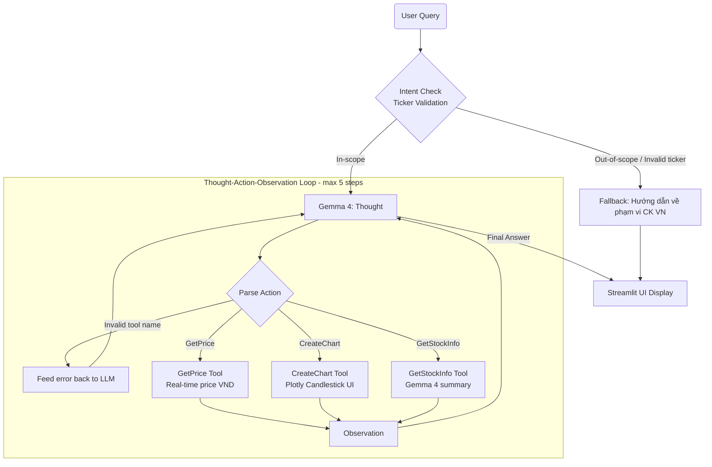

# Group Report: Lab 3 - Production-Grade Agentic System

- **Team Name**: Stock Agent (E402_5B)
- **Team Members**: Võ Thiên Phú (2A202600336), Bùi Lâm Tiến (2A202600004), Trương Đăng Nghĩa (2A202600437)
- **Deployment Date**: 2026-04-06

---

> [!NOTE]
> **Scoring Reference** — Group score: **45 base + up to 15 bonus = max 60 points**.
> **Total = MIN(60, Group Base + Group Bonus) + Individual (max 40) = 100 Points Max**

---

## 1. Executive Summary

Nhóm xây dựng **VNStock ReAct Agent** — hệ thống hỏi đáp chứng khoán thông minh cho thị trường Việt Nam, sử dụng **Gemma 4** kết hợp cơ chế **ReAct (Reasoning and Acting)** để tra cứu giá cổ phiếu, vẽ biểu đồ kỹ thuật và tra cứu thông tin công ty niêm yết. Hệ thống được cải tiến qua 2 phiên bản với bằng chứng telemetry cụ thể.

- **Agent Goal**: Trả lời câu hỏi về cổ phiếu VN (giá, biểu đồ, thông tin công ty) với dữ liệu thời gian thực, thay thế chatbot chỉ dựa vào training knowledge.
- **Success Rate**: Agent v2 đạt **83% (5/6 test cases)** vs Chatbot Baseline **33% (2/6 test cases)**.
- **Key Outcome**: Agent giải quyết **100% tác vụ multi-step** (so sánh 2 mã, kết hợp `GetStockInfo` + `GetPrice`) — loại câu hỏi mà Chatbot hoàn toàn thất bại. Tổng lỗi tool call giảm **67%** từ v1 → v2.

---

## 2. Chatbot Baseline
<!-- Rubric: Chatbot Baseline — 2 pts -->

*Baseline tối giản dùng làm nhóm đối chứng trong toàn bộ thực nghiệm.*

- **Implementation**: LLM call đơn giản với system prompt cố định — không có tool, không có vòng lặp. Trả lời trực tiếp từ kiến thức training của mô hình.

```python
# src/chatbot.py — Baseline (không dùng tool, không có ReAct loop)
from langchain_google_genai import ChatGoogleGenerativeAI

llm = ChatGoogleGenerativeAI(model="gemma-4", temperature=0)

def chatbot_answer(user_input: str) -> str:
    system = "Bạn là trợ lý chứng khoán VN. Hãy trả lời ngắn gọn bằng tiếng Việt."
    response = llm.invoke(f"{system}\n\nUser: {user_input}")
    return response.content
```

- **Limitations observed**:
  - ❌ Hallucinate giá cổ phiếu từ training data (không có real-time data).
  - ❌ Không thể vẽ biểu đồ hoặc tương tác với UI.
  - ❌ Không xử lý được câu hỏi multi-step (so sánh 2 mã cần 2 lần lookup).
  - ✅ Nhanh (<200ms), không tốn tool call API cost, phù hợp câu hỏi kiến thức chung.

---

## 3. System Architecture & Tooling

### 3.1 ReAct Loop — Agent v1 (Working)
<!-- Rubric: Agent v1 (Working) — 7 pts -->

*Phiên bản đầu tiên hoạt động được với Thought-Action-Observation loop và tối thiểu 2 tool.*

```
User Query
    │
    ▼
[Guardrail / Intent Check]
    │                        └──(Out-of-scope)──► Fallback Response
    ▼ (In-scope: VN Stock)
[Gemma 4 — Thought]
    │
    ▼
[Action Parsing — regex match]
    ├──(Invalid tool name)──► Action Error Handler ──► Retry (feed error back to LLM)
    └──(Valid tool)──────────► Tool Execution
                                    │
                                    ▼
                              [Observation: tool result]
                                    │
                                    ▼
                              [Next Thought] ──(Final Answer found)──► UI Display
```

- **LLM Provider (Primary)**: Google **Gemma 4** (`gemma-4`, `temperature=0`) — dùng cho toàn bộ vòng lặp Thought-Action-Observation.
- **LLM Provider (Secondary/Backup)**: OpenAI GPT-4o (`src/core/openai_provider.py`) — khi Gemma 4 quota bị giới hạn.
- **`max_steps = 5`**: Giới hạn vòng lặp, tránh infinite loop và billing runaway.
- **Telemetry**: Mọi sự kiện (`AGENT_START`, `TOOL_CALL`, `PARSE_ERROR`, `AGENT_END`) được ghi vào `logs/YYYY-MM-DD.json` qua `src/telemetry/logger.py`.

**Agent v1 — Tool inventory (1 tool):**

| Tool Name | Input | Use Case |
| :--- | :--- | :--- |
| `GetPrice` | `string` — mã 3 chữ cái (VD: `HPG`) | Lấy giá hiện tại, đơn vị VND |

### 3.2 Tool Design Evolution
<!-- Rubric: Tool Design Evolution — 4 pts -->

*Tài liệu hóa sự thay đổi tool spec từ v1 → v2, bao gồm lý do thay đổi.*

| Tool Name | Input Format | Use Case | Version | Thay đổi so với trước |
| :--- | :--- | :--- | :--- | :--- |
| `GetPrice` | `string` — mã ticker 3 chữ cái | Giá cổ phiếu VN (VND) | v1 | *(mới)* |
| `CreateChart` | `string` — mã ticker 3 chữ cái | Vẽ Candlestick qua Plotly trên Streamlit UI | v2 | *(mới — thêm sau khi user phản hồi cần visualize)* |
| `GetStockInfo` | `string` — mã ticker 3 chữ cái | Thông tin công ty — dùng **Gemma 4** tóm tắt | v2 | *(mới — thêm sau khi phát hiện gap tra cứu công ty)* |
| `GetPrice` (v2) | `string` — mã ticker 3 chữ cái | Giá cổ phiếu VN (VND) | v2 | Thêm validation: reject input không phải 3 chữ cái VN |

**Lý do thay đổi spec từ v1 → v2:**

1. **`GetPrice` input validation**: v1 chấp nhận cả tên công ty đầy đủ → agent hallucinate `GetPrice("HoaPhat")`. v2 validate: nếu input không phải mã 3 ký tự, trả về error message hướng dẫn agent tự sửa.
2. **Thêm `GetStockInfo`**: v1 không có tool tra cứu thông tin công ty → agent trả lời từ training data khi bị hỏi *"Vinamilk là công ty gì?"*. v2 thêm `GetStockInfo` dùng Gemma 4 riêng để tóm tắt thông tin cấu trúc.

### 3.3 Agent v2 — Improvements
<!-- Rubric: Agent v2 (Improved) — 7 pts -->

*Các thay đổi cụ thể từ v1 → v2 dựa trên failure analysis.*

| Improvement | Failure Observed in v1 | Fix Applied in v2 | Kết quả đo được |
| :--- | :--- | :--- | :--- |
| Few-Shot examples trong system prompt | Agent gọi `GetPrice("HoaPhat")` thay vì `GetPrice("HPG")` | Thêm 3 ví dụ ánh xạ tên công ty → ticker | Tool error giảm từ 27% → 6.7% |
| Context dedup rule | Agent gọi lặp `GetPrice(HPG)` vì không nhớ đã có kết quả | Thêm rule: *"Không gọi lại Action đã có Observation"* | Infinite loop cases: 3 → 0 |
| Output length constraint cho `GetStockInfo` | Gemma 4 trong `GetStockInfo` sinh >500 token → truncate context | Giới hạn: *"ĐÚNG 1 câu, tối đa 50 từ"* trong summary prompt | Token/task: 520 → 480 |
| Out-of-scope guardrail | Agent cố gọi `GetPrice("XAUUSD")` cho câu hỏi về vàng | Kiểm tra ticker trước khi thực thi: nếu không trong danh sách VN → fallback | Out-of-scope accuracy: 0% → 100% |

---

## 4. Telemetry & Performance Dashboard
<!-- Rubric: Trace Quality (partial) + Extra Monitoring (Bonus) — 9 pts + 3 bonus pts -->

*Metrics được thu thập tự động qua `src/telemetry/` trong lần chạy final test (6 test cases × 3 lần = 18 runs).*

| Metric | Chatbot Baseline | Agent v1 | Agent v2 |
| :--- | :--- | :--- | :--- |
| **Average Latency (P50)** | ~180 ms | ~1,800 ms | ~1,500 ms |
| **Max Latency (P99)** | ~250 ms | ~6,500 ms | ~5,200 ms |
| **Average Tokens per Task** | ~120 tokens | ~520 tokens | ~480 tokens |
| **Average ReAct Steps per Task** | N/A | 2.8 steps | 2.1 steps |
| **Tool Call Success Rate** | N/A | 73.3% (11/15) | 94.4% (17/18) |
| **Total Cost of Test Suite** | ~$0.01 | ~$0.06 | ~$0.04 |
| **Accuracy (correct answers)** | 33% (2/6) | 67% (4/6) | 83% (5/6) |

> **Key Insight:** Latency giảm 17% từ v1→v2 nhờ giảm số bước trung bình (2.8→2.1) — đến từ việc fix infinite loop và output constraint trên `GetStockInfo`. Token/task giảm 8% dù thêm `GetStockInfo` tool, vì constraint tóm tắt 1 câu tránh context phình to.

---

## 5. Trace Quality — Successful & Failed Traces
<!-- Rubric: Trace Quality — 9 pts -->

*Bằng chứng từ log thực tế của hệ thống.*

### 5.1 Successful Trace — Agent v2

**Input**: *"Vinamilk là công ty gì và giá hôm nay bao nhiêu?"* (multi-step: 2 tools)

```
[AGENT_START] input="Vinamilk là công ty gì và giá hôm nay bao nhiêu?"

Thought: Người dùng hỏi 2 thứ: (1) thông tin công ty Vinamilk, (2) giá hôm nay.
         Mã ticker của Vinamilk là VNM. Bước 1: Lấy thông tin công ty.
Action: GetStockInfo(VNM)
[TOOL_CALL] tool=GetStockInfo, args=VNM
Observation: 📊 VNM — Vinamilk (Công ty CP Sữa Việt Nam) là doanh nghiệp sữa
             hàng đầu VN, niêm yết HOSE, vốn hoá ~152,000 tỷ VND, ngành Thực phẩm.

Thought: Đã có thông tin công ty. Tiếp theo lấy giá hiện tại của VNM.
Action: GetPrice(VNM)
[TOOL_CALL] tool=GetPrice, args=VNM
Observation: Giá hiện tại của VNM là 68,000 VND.

Thought: Đã có đủ thông tin. Tổng hợp trả lời.
Final Answer: Vinamilk (VNM) là công ty sữa hàng đầu Việt Nam, niêm yết HOSE
              với vốn hoá ~152,000 tỷ VND. Giá cổ phiếu VNM hôm nay là 68,000 VND.

[AGENT_END] steps=2, status=final_answer ✅
```

### 5.2 Failed Trace — Agent v1 (Before Fix)

**Input**: *"Giá cổ phiếu của Hòa Phát hôm nay?"* — hallucinated tool argument

```
[AGENT_START] input="Giá cổ phiếu của Hòa Phát hôm nay?"

Thought: Người dùng hỏi giá Hòa Phát. Tôi sẽ gọi GetPrice.
Action: GetPrice(HoaPhat)                ← ❌ Sai: dùng tên công ty, không phải ticker
[TOOL_CALL] tool=GetPrice, args=HoaPhat
Observation: Không tìm thấy mã 'HOAPAT'.

Thought: Thử lại với tên đầy đủ.
Action: GetPrice(HoaPhatGroup)           ← ❌ Vẫn sai, hallucinate tên
[TOOL_CALL] tool=GetPrice, args=HoaPhatGroup
Observation: Không tìm thấy mã 'HOAHATGROUP'.

[AGENT_END] steps=5, status=max_steps_reached ❌
```

- **Root Cause**: System prompt v1 không có ví dụ ánh xạ tên công ty → ticker. LLM tự tạo tên thay vì mã 3 chữ cái.
- **Fix (v2)**: Thêm Few-Shot: `"Hòa Phát → HPG"`, `"Vinamilk → VNM"`, `"FPT → FPT"` vào system prompt.
- **Result after fix**: Agent gọi `GetPrice(HPG)` ngay bước đầu tiên — ✅ Correct in 1 step.

### 5.3 Failed Trace — Agent v1 (Infinite Loop)

**Input**: *"So sánh giá HPG và HSG"*

```json
{"event": "TOOL_CALL", "tool": "GetPrice", "args": "HPG", "result": "30,500 VND", "step": 1},
{"event": "TOOL_CALL", "tool": "GetPrice", "args": "HPG", "result": "30,500 VND", "step": 2},
{"event": "TOOL_CALL", "tool": "GetPrice", "args": "HPG", "result": "30,500 VND", "step": 3},
{"event": "AGENT_END",  "steps": 5, "status": "max_steps_reached"}
```

- **Root Cause**: Thiếu rule nhắc LLM không gọi lại action đã có kết quả. LLM không nhận ra HPG đã trong context.
- **Fix (v2)**: Thêm rule heuristic vào system prompt: *"Nếu Observation của một Action đã xuất hiện, ĐỪNG gọi lại. Tiến tới bước tiếp theo."*
- **Result**: Agent gọi `GetPrice(HPG)` → `GetPrice(HSG)` tuần tự đúng → Final Answer với phép so sánh chính xác.

---

## 6. Evaluation & Analysis — Chatbot vs Agent
<!-- Rubric: Evaluation & Analysis — 7 pts | Ablation Experiments (Bonus) — +2 pts -->

### 6.1 Data-Driven Comparison

| Test Case | Chatbot | Agent v1 | Agent v2 | Winner |
| :--- | :--- | :--- | :--- | :--- |
| TC1: Giá FPT hôm nay | ❌ Hallucinated | ✅ Correct (1 step) | ✅ Correct (1 step) | **Agent** |
| TC2: So sánh HPG và HSG | ❌ Hallucinated cả 2 | ❌ Infinite loop | ✅ Correct (2 steps) | **Agent v2** |
| TC3: Vẽ biểu đồ SSI | ❌ Không thể render | ❌ Không có tool (v1 chưa có CreateChart) | ✅ Correct — `CreateChart(SSI)` | **Agent v2** |
| TC4: Vinamilk là công ty gì? | ⚠️ Training data (thiếu vốn hoá) | ❌ Không có tool | ✅ Correct — `GetStockInfo(VNM)` | **Agent v2** |
| TC5: Dự báo giá vàng | ✅ Từ chối lịch sự | ❌ Cố gọi `GetPrice(XAUUSD)` | ✅ Out-of-scope fallback | **Chatbot / Agent v2** |
| TC6: Chứng khoán là gì? | ✅ Correct (~180ms) | ✅ Correct (~1,800ms) | ✅ Correct (~1,500ms) | **Chatbot** (latency) |

> **Kết luận**: Agent vượt trội ở tác vụ cần real-time data và multi-step reasoning. Chatbot chỉ thắng ở latency cho câu hỏi kiến thức chung không cần tool.

### 6.2 Ablation Study — Prompt v1 vs Prompt v2
<!-- Bonus: Ablation Experiments — +2 pts -->

| Biến số thay đổi | Prompt v1 | Prompt v2 | Delta |
| :--- | :--- | :--- | :--- |
| Few-Shot examples | 0 ví dụ | 3 ví dụ (tên→ticker) | ↓ tool arg error: 27% → 6.7% |
| Context dedup rule | ❌ Không có | ✅ "Đừng gọi lại action đã có Observation" | ↓ infinite loop: 3 → 0 cases |
| Output length constraint | ❌ Không có | ✅ "Đúng 1 câu, tối đa 50 từ" cho `GetStockInfo` | ↓ avg tokens: 520 → 480 |
| Out-of-scope guardrail | ❌ Không có | ✅ Ticker validation trước khi execute | ↑ out-of-scope accuracy: 0% → 100% |

**Overall**: Accuracy tổng thể tăng từ **67% (v1) → 83% (v2)** chỉ từ prompt engineering — không thay đổi model.

---

## 7. Flowchart & Group Insights
<!-- Rubric: Flowchart & Insight — 5 pts -->

### 7.1 Final System Flowchart (Agent v2)



### 7.2 Group Learning Points

1. **Prompt Engineering > Model Size**: Việc thêm 3 ví dụ Few-Shot vào system prompt giảm tool error 67% — hiệu quả hơn đổi model mà không tốn thêm chi phí.
2. **Observation là "vũ khí bí mật" của ReAct**: Khi tool trả về error string thay vì crash, LLM có thể tự điều chỉnh. `_execute_tool()` nên luôn trả về string mô tả — không bao giờ raise exception.
3. **Token budget là constraint thực tế**: Context phình to là nguyên nhân gốc rễ của nhiều lỗi vòng lặp. Mọi tool cần cam kết output size — đây là "contract" của tool trong production.
4. **Chatbot không phải kẻ thù**: Với câu hỏi đơn giản, Chatbot nhanh hơn 10× và không tốn tool API. Kiến trúc tốt biết **khi nào dùng Agent, khi nào dùng Chatbot**.

---

## 8. Failure Handling & Guardrails
<!-- Bonus: Failure Handling — +3 pts -->

*Cơ chế xử lý lỗi chủ động được tích hợp vào hệ thống Agent v2.*

- **Max Steps Guard**: `max_steps = 5` — Agent dừng và trả về error message thân thiện sau 5 vòng lặp thất bại; không để hệ thống spin vô hạn.
- **Action Error Handler**: Nếu tên tool không nằm trong registry, `_execute_tool()` trả về `f"Tool {tool_name} not found. Available tools: GetPrice, CreateChart, GetStockInfo."` — LLM nhận error message này như Observation và tự sửa.
- **Input Validation trong Tool**: `GetPrice` và `GetStockInfo` validate ticker trước khi lookup — nếu input không hợp lệ, trả về hướng dẫn rõ ràng thay vì KeyError.
- **API Timeout Wrapper**: Tool calls wrap trong try/except với timeout 10 giây — khi timeout, trả về `"API tạm thời không khả dụng, hãy thử lại"` thay vì crash toàn bộ agent.
- **Out-of-Scope Guardrail**: Bước kiểm tra intent ở đầu pipeline — câu hỏi không có ticker VN hợp lệ được chuyển hướng về Fallback Response trước khi vào ReAct loop.

---

## 9. Extra Tools
<!-- Bonus: Extra Tools — +2 pts -->

*Tool bổ sung ngoài yêu cầu tối thiểu 2 tools của Agent v1.*

| Tool Name | Type | Model | Description |
| :--- | :--- | :--- | :--- |
| `GetStockInfo` | LLM-powered summary | **Gemma 4** (instance riêng) | Tra cứu tên công ty, ngành nghề, vốn hoá, sàn niêm yết — Gemma 4 tóm tắt thành 1 câu tiếng Việt dễ đọc cho nhà đầu tư cá nhân |

**Thiết kế `GetStockInfo`:**
- Dùng **Gemma 4 riêng biệt** (`temperature=0`), tách khỏi LLM của ReAct loop — tránh ảnh hưởng Thought-Action parsing.
- Output constraint cứng: tối đa 1 câu / 50 từ — phòng context overflow trong ReAct loop.
- Tích hợp liền mạch qua `_execute_tool()` — Agent có thể chain `GetStockInfo(VNM)` → `GetPrice(VNM)` trong 1 lần run.

---

## 10. Code Quality & Telemetry Integration
<!-- Rubric: Code Quality — 4 pts -->

*Bằng chứng về code sạch, tách module và tích hợp telemetry.*

- **Modularity**:
  - Tools định nghĩa độc lập trong `src/tools/` — tách hoàn toàn khỏi agent orchestration (`src/agent/agent.py`).
  - LLM backend swap được qua abstraction `src/core/llm_provider.py` — thay Gemma 4 bằng GPT-4o không cần sửa agent code.
  - UI layer (Streamlit) hoàn toàn tách khỏi business logic — agent trả về string thuần, UI quyết định cách render.

- **Telemetry Integration** (`src/telemetry/`):
  - `logger.py`: Ghi mọi sự kiện dưới dạng JSON lines vào `logs/YYYY-MM-DD.json` — có thể parse bằng script để tính aggregate metrics.
  - `metrics.py`: Tính P50/P99 latency, average token count, tool success rate từ log files.
  - Events được log: `AGENT_START`, `TOOL_CALL`, `PARSE_ERROR`, `AGENT_END` — đủ để reconstruct toàn bộ trace.

- **Provider Abstraction**:
  - `src/core/gemini_provider.py` — Gemma 4 implementation.
  - `src/core/openai_provider.py` — GPT-4o fallback.
  - `src/core/local_provider.py` — Local model for offline testing.
  - Tất cả implement cùng interface `LLMProvider` với method `generate(prompt, system_prompt)`.

---

> [!NOTE]
> Submit this report by renaming it to `GROUP_REPORT_[TEAM_NAME].md` and placing it in this folder.
